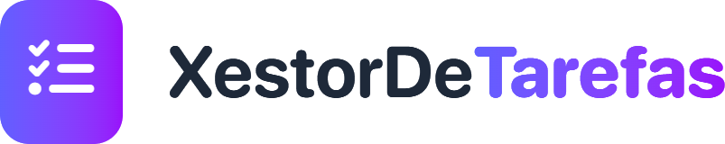
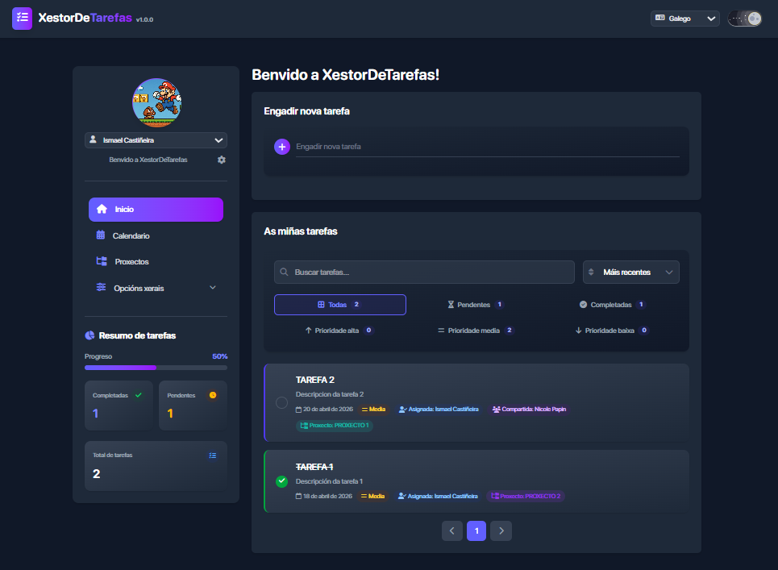

<div align="center">



<br>

**Aplicación de xestión persoal de tarefas e proxectos**

Planifica o teu día, crea e completa tarefas, agrupa o traballo por proxectos e cliente,
garda notas e listas de comprobación, e revisa todo no calendario — no ordenador ou no
móbil, sincronizado entre dispositivos e detrás do teu propio inicio de sesión. Sen subscrición, sen anuncios, cos teus datos na túa propia Firebase.

<br>

[](LICENSE)
[](https://nodejs.org)
[](#-app-android)




</div>

## Por que

As aplicacións de tarefas comerciais pídenche unha conta nun servidor alleo, gardan os teus
datos onde non ves, e tarde ou cedo poñen detrás dun pago o que antes era gratis.
XestorDeTarefas nace da idea contraria: **a app é túa e os datos tamén**.

- Os datos viven no teu propio proxecto de Firebase, non nun servizo de terceiros.
- Todo nun só sitio: tarefas, proxectos con cliente, notas e calendario, sen saltar entre apps.
- O mesmo estado no ordenador e no móbil, sincronizado ao instante.
- Pensada en galego dende o primeiro día (e tamén en castelán e inglés).
- Sen subscrición, sen anuncios, sen límites artificiais. Código aberto con licenza MIT.

## Funcionalidades

- ✅ Xestión de tarefas: crear, editar, eliminar, completar, buscar, filtrar e ordenar.
- 📝 Módulo de notas: notas de texto e notas tipo lista/checklist con cor personalizada.
- 📌 Ordenación de notas por fixación e última actualización.
- 👥 Xestión de usuarios.
- 📁 Xestión de proxectos con datos de cliente.
- 📅 Vista de calendario anual/mensual con sincronización con Google Calendar.
- 🔥 Persistencia e sincronización con Firebase Firestore (estado compartido).
- 🔑 Lectura de credenciais KDBX (KeePass) dos proxectos, restrinxida a admin (só na web).
- 📱 App Android feita co mesmo código, con vistas adaptadas ao móbil.

## Configuración

### Requisitos

- Node.js 18+ (recomendado 20+)
- npm
- Windows, Linux ou macOS
- Para a app Android: Android Studio con JDK 21

### 🔥 Firebase

Para usar a mesma app desde dous ordenadores/móbiles e compartir cambios:

1) Crea un proxecto en Firebase e activa Firestore.
2) Enche cos datos necesarios o arquivo `.env.example` na raíz do proxecto e renomeao a `.env`.
4) Arranca a app (`npm run dev` ou `iniciar-app.bat`) nos dispositivos que queiras.

A app usa Firestore como persistencia principal e sincroniza cambios entre sesións.

### 🔒 KDBX (KeePass)

- A lectura de KDBX está dispoñible desde Proxectos e restrinxida a usuario admin.
- Requírese ruta e contrasinal válidas.
- A base KDBX con Argon2 está soportada na execución local do proxecto.
- Só funciona na web: a lectura faise no servidor de Vite, que non existe dentro da app Android.

## 📱 App Android

A app Android sae deste mesmo repositorio: é a web compilada en modo `android` e empaquetada con [Capacitor](https://capacitorjs.com). Os datos son os mesmos (o mesmo documento de Firebase), así que o que fagas nun dispositivo aparece no resto.

### Scripts

| Script | Que fai |
| --- | --- |
| `npm run dev` | Web en modo desenvolvemento |
| `npm run dev:android` | A interface da app no navegador, para probala sen móbil |
| `npm run build` | Compila a web en `dist/` |
| `npm run build:android` | Compila a interface da app en `dist/` |
| `npm run android:sync` | `build:android` + copia o resultado ao proxecto `android/` |
| `npm run android:open` | Abre o proxecto en Android Studio |
| `npm run android:run` | Sincroniza e instala a app no móbil ou emulador conectado |

Despois de calquera cambio no código hai que volver xerar a app (`npm run android:run`, ou `android:sync` e compilar dende Android Studio) para que chegue ao móbil. Os datos non: sincronízanse sós por Firebase.

### Que cambia entre web e app

O código é común (Redux, Firebase, traducións e a maioría de compoñentes). As diferenzas resólvense así:

- **Vistas `*.android.jsx`:** cando se compila en modo `android`, Vite usa `Compoñente.android.jsx` se existe e, se non, `Compoñente.jsx`. A app ten a súa propia versión de `LoginView`, `UserSettingsView`, `NotesView`, `OptionsGlobalView`, `OptionsUsersView`, `ProjectsView`, `TaskFilter`, `TaskItem` e `CalendarView` (botóns sempre visibles, modais de confirmación e avisos). Se cambias unha destas vistas, mira se tamén hai que cambiar a súa parella.
- **`esApp` (`src/Utils/plataforma.js`):** para diferenzas pequenas dentro dun mesmo ficheiro (`App.jsx`, `Header.jsx`, `Sidebar.jsx`, `usuariosSlice.js`).

| | Web | App |
| --- | --- | --- |
| Sesión | Pídese o login cada vez | Queda lembrada no móbil |
| Tema | Selector na cabeceira e tema por defecto de cada usuario | Segue o tema do sistema |
| Idioma | Selector na cabeceira | Idioma por defecto do usuario |
| Menú | Barra lateral (botón flotante en pantallas pequenas) | Tocando a cabeceira |
| Pechar sesión | Con confirmación | Directo |
| KDBX | Si | Non |

## Estrutura xeral

```text
xestor-de-tarefas/
├─ public/
│  └─ Images/                     # Logo, banner e capturas do README
├─ kdbx/
│  └─ Database.kdbx               # Base KeePass local (credenciais de proxectos)
├─ scripts/                       # Utilidades auxiliares
├─ android/                       # Proxecto nativo Android (Capacitor)
├─ src/
│  ├─ App/
│  │  ├─ store.js                 # configureStore + rexistro de slices
│  │  ├─ persistence.js           # Carga/gardado do estado
│  │  ├─ autenticacion.js         # Validación do login (Firebase + local)
│  │  └─ firebase.js              # Inicialización de Firebase/Firestore
│  ├─ Components/                 # UI por áreas (*.android.jsx = versión da app)
│  │  ├─ Auth/                    # LoginView
│  │  ├─ Layout/                  # Header, Sidebar, UserSettingsView
│  │  ├─ Tasks/                   # TasksList, TaskItem, TaskForm, TaskFilter
│  │  ├─ Projects/                # ProjectsView (con lectura KDBX)
│  │  ├─ Notes/                   # NotesView (notas de texto e checklist)
│  │  ├─ Calendar/                # CalendarView (anual/mensual/diaria)
│  │  ├─ Options/                 # OptionsGlobalView, OptionsUsersView
│  │  └─ UI/                      # DarkMode, ToastCenter e compoñentes comúns
│  ├─ Features/                   # Slices Redux Toolkit
│  │  ├─ Tasks/tareasSlice.js
│  │  ├─ Projects/proxectosSlice.js
│  │  ├─ Notes/notasSlice.js
│  │  ├─ Users/usuariosSlice.js
│  │  ├─ Theme/temaSlice.js
│  │  └─ Language/idiomaSlice.js
│  ├─ i18n/
│  │  └─ translations.js          # Traducións gl / es / en
│  ├─ Assets/                     # Fontes SF Pro e Font Awesome
│  ├─ Styles/DarkMode.css         # Estilos do tema escuro
│  ├─ Utils/                      # plataforma.js (esApp) e toast.js
│  ├─ App.jsx                     # Compoñente raíz e enrutado de vistas
│  ├─ main.jsx                    # Punto de entrada (Provider + render)
│  └─ index.css                   # Estilos base + Tailwind
├─ index.html                     # HTML raíz de Vite
├─ vite.config.js                 # Vite + React + Tailwind + endpoint /api/kdbx/read + modo android
├─ capacitor.config.json          # appId, appName e webDir (dist)
├─ eslint.config.js               # Regras ESLint 9
├─ jsconfig.json                  # Alias @ → /src
├─ iniciar-app.bat                # Arranque rápido en Windows
├─ .env / .env.example            # Credenciais de Firebase
└─ package.json
```

## Evolución por versión

### v2.2.0

- A app Android intégrase neste repositorio (antes estaba en `xestor-de-tarefas-app`).
- Novos scripts `dev:android`, `build:android` e `android:sync/open/run`.
- Vistas propias da app en ficheiros `*.android.jsx`, co resto do código compartido.
- Login contra Firebase tamén na app, con sesión lembrada só no móbil.
- Filtro de tarefas "sen proxecto" e conta de tarefas por proxecto.
- A sesión dun dispositivo xa non cambia o usuario activo dos demais ao sincronizar.
- Usuario de exemplo por defecto: `ipardelo`.

### v2.1.0

- Visualización por días no calendario
- Melloras visuais en todos os módulos

### v2.0.0

- Novo módulo de **Notas**.
- Accións en notas: crear, editar, eliminar, fixar e marcar ítems.

### v1.1.0

- Melloras de UI e organización da app para uso diario.
- Compoñenente de login.
- Integración co calendario de Google.

### v1.0.0

- Base da aplicación de xestión de tarefas.
- Crear, editar, eliminar e completar tarefas.
- Filtros, busca e ordenación de tarefas.
- Persistencia local no dispositivo.
- Soporte de tema claro/escuro e internacionalización inicial (`gl`/`es`/`en`).
- Ampliación funcional con módulo de proxectos.
- Xestión de usuarios en local con rol administrador.
- Vista de calendario anual/mensual.

## Autor

[Ismael Castiñeira](https://ipardelo.es)

```bash
VIVA GHALISIA E A COSTA DA MORTE! 💀
```